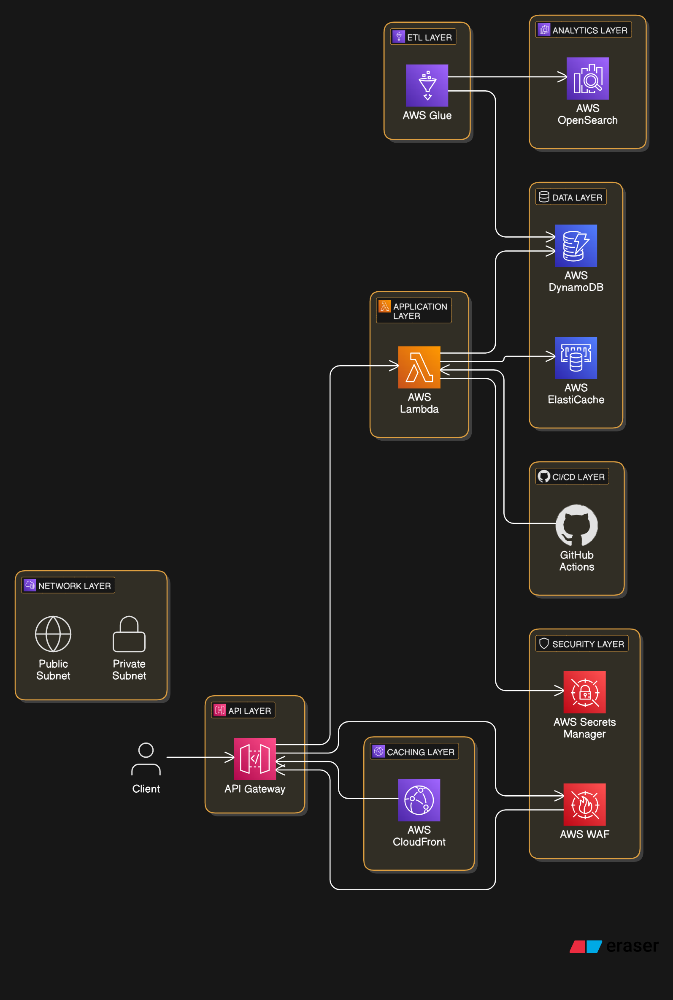

# URL Shortener Application

The **URL Shortener Application** is a robust, secure, and scalable system designed to shorten URLs, manage redirects, and deliver insightful usage analytics. Built with **Java 21** and **Spring Boot 3**, it leverages modern AWS cloud-native services to ensure high availability, performance, and security.

---
<br>

## **Table of Contents**

## Table of Contents

1. [Introduction](#1-introduction)
2. [Architecture Overview](#2-architecture-overview)
3. [Design Patterns](#3-design-patterns)
4. [Code Implementation](#4-code-implementation)
   - [4.1 Dependencies (`pom.xml`)](#41-dependencies-pomxml)
   - [4.2 Configuration Properties (`application.yml`)](#42-configuration-properties-applicationyml)
   - [4.3 Secrets Management (`SecretsService.java`)](#43-secrets-management-secretsservicejava)
   - [4.4 URL Shortener Service (`UrlShortenerService.java`)](#44-url-shortener-service-urlshortenerservicejava)
   - [4.5 Redis Configuration (`RedisConfig.java`)](#45-redis-configuration-redisconfigjava)
   - [4.6 Controller Class (`UrlShortenerController.java`)](#46-controller-class-urlshortenercontrollerjava)
   - [4.7 OAuth2 Configuration (`SecurityConfig.java`)](#47-oauth2-configuration-securityconfigjava)
   - [4.8 OpenAPI Specification (Swagger)](#48-openapi-specification-swagger)
5. [Infrastructure as Code (Terraform)](#5-infrastructure-as-code-terraform)
   - [5.1 Terraform Folder Structure](#51-terraform-folder-structure)
   - [5.2 VPC Configuration + Endpoints](#52-vpc-configuration--endpoints)
   - [5.3 Network Configuration](#53-network-configuration)
   - [5.4 SSL Certificates with ACM](#54-ssl-certificates-with-acm)
   - [5.5 Application Load Balancer (ALB)](#55-application-load-balancer-alb)
   - [5.6 Domain Configuration](#56-domain-configuration)
   - [5.7 AWS WAF Configuration](#57-aws-waf-configuration)
   - [5.8 API Gateway](#58-api-gateway)
   - [5.9 AWS Lambda Function](#59-aws-lambda-function)
   - [5.10 DynamoDB Table](#510-dynamodb-table)
   - [5.11 Redis (ElastiCache)](#511-redis-elasticache)
   - [5.12 AWS Secrets Manager](#512-aws-secrets-manager)
   - [5.13 AWS CloudFront Configuration](#513-aws-cloudfront-configuration)
6. [CI/CD Pipeline (GitHub Actions)](#6-cicd-pipeline-github-actions)
7. [Steps to Run the Project](#7-steps-to-run-the-project)
8. [Roadmap](#8-roadmap)
9. [Architecture Diagrams](#9-architecture-diagrams)
10. [Conclusion](#10-conclusion)

---
<br>

## 1. Introduction

The **URL Shortener Application** allows users to generate short URLs for long links, enabling seamless redirection while providing analytics and scalability. Key highlights include:

- **Shorten URLs** and manage redirects.
- **Caching**: Redis (AWS ElastiCache) ensures low-latency lookups.
- **Persistence**: DynamoDB securely stores the URL mappings.
- **Authentication**: Secures endpoints using OAuth2 (Google).
- **Automation**: CI/CD pipeline with GitHub Actions and Terraform.
- **ETL and Analytics**: AWS Glue and OpenSearch for metadata and usage statistics.

This document outlines the application's **architecture**, key **design patterns**, **code implementation**, **deployment infrastructure**, and instructions for running the project locally or on AWS.

---
<br>

## 2. Architecture Overview

The **URL Shortener Application** follows a cloud-native, serverless architecture using AWS services. This design ensures scalability, high availability, and low operational overhead.

---

### 2.1 High-Level Architecture

1. **API Gateway**: Entry point for all HTTP requests. It routes incoming requests to AWS Lambda.
2. **AWS Lambda**: Processes business logic, such as shortening URLs and managing redirects.
3. **Redis (AWS ElastiCache)**: Provides low-latency caching for frequently accessed URL mappings.
4. **DynamoDB**: Persistent NoSQL database for storing the mapping between short and long URLs.
5. **AWS Secrets Manager**: Manages secure storage and retrieval of sensitive credentials.
6. **AWS WAF**: Adds rate limiting and protects APIs against malicious traffic.
7. **CloudFront**: Caches API responses globally to reduce latency and improve performance.
8. **AWS Glue**: Extracts metadata for ETL processing and stores results in S3.
9. **AWS OpenSearch**: Provides search and visualization of usage analytics.
10. **AWS CloudWatch**: Monitors system health, logs, and metrics to provide observability.

---

### 2.2 Data Flow

The following outlines how data flows through the system:

1. **Request Handling**:
   - A client sends a `POST` or `GET` request to the **API Gateway**.
   - **API Gateway** routes the request to the appropriate **AWS Lambda** function.

2. **Cache Lookup**:
   - For retrieval operations, **AWS Lambda** first checks **Redis (ElastiCache)** for the shortened URL.
   - If the URL exists in Redis, it is returned immediately.

3. **Database Lookup**:
   - If the URL is not found in Redis, Lambda fetches it from **DynamoDB** and updates Redis for future requests.

4. **Short URL Creation**:
   - For a `POST` request, a short URL is generated, stored in **DynamoDB**, and cached in **Redis**.

5. **ETL Processing**:
   - **AWS Glue** periodically extracts metadata (e.g., headers) from the original URLs.
   - Processed data is stored in **Amazon S3**.

6. **Analytics**:
   - Metadata and usage data are indexed in **AWS OpenSearch** for visualization and reporting.

7. **Monitoring**:
   - **CloudWatch** logs all Lambda invocations, errors, and performance metrics.
   - Alerts are configured for failures, high latency, or rate limiting breaches.

---

### 2.3 Diagram

For a visual representation of the architecture:

- **Use draw.io or Lucidchart** to create the diagram.
- Key components to include:
  - API Gateway → Lambda → Redis → DynamoDB
  - Secrets Manager, WAF, CloudFront for supporting infrastructure.
  - AWS Glue → S3 → OpenSearch for ETL pipelines and analytics.



---

### Summary

The architecture combines serverless computing with AWS managed services to deliver:

1. **Scalability**: Handles increasing workloads using Lambda and DynamoDB.
2. **Performance**: Redis caching and CloudFront reduce response times.
3. **Security**: WAF protects APIs; Secrets Manager manages credentials.
4. **Observability**: CloudWatch logs, metrics, and alarms provide full visibility.
5. **Analytics**: AWS Glue and OpenSearch process and visualize usage data.

---
<br>

## 3. Design Patterns

The application follows industry-standard **design patterns** to ensure modularity, scalability, and clean code architecture.

---

### 3.1 Singleton Pattern

Ensures that only one instance of shared resources, such as clients and connections, is created and reused throughout the application.

- **Use Case**: 
  - Redis connection (`RedisTemplate`).
  - DynamoDB client.
- **Benefit**: Reduces overhead by managing resource initialization efficiently.

---

### 3.2 Builder Pattern

Simplifies the creation of complex AWS SDK requests with a clean and fluent API for improved readability.

- **Use Case**:
  - Constructing **DynamoDB PutItem/GetItem requests**.
  - Building structured requests for **AWS Secrets Manager**.
- **Benefit**: Enhances maintainability and eliminates redundant request-building logic.

---

### 3.3 Factory Pattern

Uses Spring Boot’s **Dependency Injection** to create and manage beans for shared resources.

- **Use Case**:
  - Instantiating Redis clients, DynamoDB clients, and service classes.
- **Benefit**: Decouples object creation from the main application logic and improves testability.

---

### 3.4 Strategy Pattern

Encapsulates multiple strategies for data access and storage, enabling flexible logic execution based on use cases.

- **Use Case**: 
  - **Cache-first strategy**:
    - Attempt to retrieve data from **Redis** first.
    - Fallback to **DynamoDB** if the cache misses.
- **Benefit**: Improves performance by reducing database latency through caching.

---

### 3.5 Template Method Pattern

Provides a common template for Redis operations while allowing for specific implementations.

- **Use Case**: 
  - Using `RedisTemplate` to simplify `GET`, `SET`, and expiry operations for URL lookups.
- **Benefit**: Standardizes interactions with Redis and reduces code duplication.

---

### 3.6 Proxy Pattern

The **API Gateway** acts as a proxy to forward incoming HTTP requests to the AWS Lambda function.

- **Use Case**: Decouples the API consumer (clients) from the internal application logic.
- **Benefit**: Improves scalability and adds a unified entry point for API management.

---

### 3.7 Observer Pattern

**CloudWatch** acts as an observer, monitoring system health, metrics, and logs in real-time.

- **Use Case**:
  - Observing Lambda function metrics like invocation count, latency, and errors.
  - Configuring CloudWatch alarms for failures or anomalies.
- **Benefit**: Ensures proactive system monitoring and automated alerting.

---

### 3.8 Decorator Pattern

Adds additional functionality, such as **security** and **rate limiting**, without modifying the core business logic.

- **Use Case**: 
  - AWS WAF applies rate limiting and IP filtering to secure the **API Gateway**.
- **Benefit**: Enhances security transparently without changing existing logic.

---

### Summary

The use of these design patterns ensures:

1. **Scalability**: Patterns like **Strategy** and **Proxy** allow for flexible logic and clean architecture.
2. **Maintainability**: Patterns such as **Singleton** and **Builder** simplify code structure and resource management.
3. **Performance**: Patterns like **Cache-first (Strategy)** reduce latency and optimize database calls.
4. **Security**: **Decorator Pattern** ensures security features (e.g., WAF) are applied seamlessly.
5. **Observability**: **Observer Pattern** helps track metrics and maintain system health.

---
<br>

## 4. Code Implementation

This section provides the key components of the application, including dependencies, configurations, and core service classes.

---

### 4.1 Dependencies (`pom.xml`)

This project uses **Spring Boot 3**, **AWS SDK**, **Redis**, and **OAuth2** for Google authentication. The dependencies ensure all required functionalities are supported.

Below is the content of `pom.xml` with the necessary dependencies:

```xml
<dependencies>
    <!-- Spring Boot Web for REST API -->
    <dependency>
        <groupId>org.springframework.boot</groupId>
        <artifactId>spring-boot-starter-web</artifactId>
    </dependency>

    <!-- Spring Boot Data Redis for caching -->
    <dependency>
        <groupId>org.springframework.boot</groupId>
        <artifactId>spring-boot-starter-data-redis</artifactId>
    </dependency>

    <!-- AWS SDK for DynamoDB -->
    <dependency>
        <groupId>software.amazon.awssdk</groupId>
        <artifactId>dynamodb</artifactId>
    </dependency>

    <!-- AWS SDK for Secrets Manager -->
    <dependency>
        <groupId>software.amazon.awssdk</groupId>
        <artifactId>secretsmanager</artifactId>
    </dependency>

    <!-- Spring Boot OAuth2 Client for Google Authentication -->
    <dependency>
        <groupId>org.springframework.boot</groupId>
        <artifactId>spring-boot-starter-oauth2-client</artifactId>
    </dependency>

    <!-- Jackson for JSON handling -->
    <dependency>
        <groupId>com.fasterxml.jackson.core</groupId>
        <artifactId>jackson-databind</artifactId>
    </dependency>

    <!-- Spring Boot Starter for Testing -->
    <dependency>
        <groupId>org.springframework.boot</groupId>
        <artifactId>spring-boot-starter-test</artifactId>
        <scope>test</scope>
    </dependency>
</dependencies>
```

#### Explanation:

1. **Spring Boot Starter Web**: Enables RESTful web services for API endpoints.
2. **Spring Boot Data Redis**: Provides caching capabilities for optimized URL lookups.
3. **AWS SDK for DynamoDB and Secrets Manager**: Interacts with AWS DynamoDB for persistent storage and Secrets Manager for secure credential retrieval.
4. **OAuth2 Client**: Supports Google Authentication for securing API endpoints.
5. **Jackson Databind**: Handles JSON serialization and deserialization.
6. **Spring Boot Starter Test**: Supports testing capabilities for unit tests and integration tests.

---

### 4.2 Configuration Properties (`application.yml`)

````yaml
app:
  base-url: https://shortener.enok.tech

aws:
  region: us-east-1
  dynamodb:
    table-name: URLMappings
  secrets:
    name: shortener/url-secrets

spring:
  redis:
    host: redis.shortener-enok.tech
    port: 6379
    timeout: 2000ms

management:
  endpoints:
    web:
      exposure:
        include: health
````

**Explanation**:  

- **`app.base-url`**:  
   - The base URL for generating shortened links. Updated to the custom subdomain `https://shortener.enok.tech`.

- **`aws.region`**:  
   - Specifies the AWS region where resources will be deployed (`us-east-1`).

- **`aws.dynamodb.table-name`**:  
   - DynamoDB table used for storing the URL mappings.

- **`aws.secrets.name`**:  
   - Reference to AWS Secrets Manager where credentials (e.g., database) are securely stored.

- **`spring.redis.host`**:  
   - Custom Redis endpoint `redis.shortener-enok.tech`. This domain will be mapped to the Redis ElastiCache endpoint using **Route 53**.

- **`management.endpoints.web.exposure.include`**:  
   - Exposes the `/actuator/health` endpoint for health checks, which can be used by AWS services like ALB or monitoring tools.

**Benefits**:  

1. **Centralized Configuration**:  
   - All critical settings, including base URLs, AWS resources, and Redis, are managed in one place.

2. **Custom Redis Endpoint**:  
   - Using `redis.shortener-enok.tech` makes the Redis endpoint cleaner and easier to reference.

3. **Secure URLs**:  
   - Base URLs are configured to use **HTTPS** for secure access.

4. **Health Monitoring**:  
   - The exposed health endpoint enables better observability and integration with monitoring tools or load balancers.

5. **Readability and Maintainability**:  
   - Clean separation of responsibilities in the `application.yml` ensures easy updates and troubleshooting.

---

### 4.3 Secrets Management (`SecretsService.java`)

The `SecretsService` class retrieves secure credentials, such as database usernames and passwords, from **AWS Secrets Manager**.

```java
package tech.enok.shortener.service;

import com.fasterxml.jackson.databind.ObjectMapper;
import org.springframework.stereotype.Service;
import software.amazon.awssdk.services.secretsmanager.SecretsManagerClient;
import software.amazon.awssdk.services.secretsmanager.model.GetSecretValueRequest;

import java.util.Map;

@Service
public class SecretsService {

    private final SecretsManagerClient secretsClient;

    public SecretsService(SecretsManagerClient secretsClient) {
        this.secretsClient = secretsClient;
    }

    public Map<String, String> getSecrets(String secretName) {
        GetSecretValueRequest request = GetSecretValueRequest.builder()
                .secretId(secretName)
                .build();
        String secretString = secretsClient.getSecretValue(request).secretString();

        try {
            return new ObjectMapper().readValue(secretString, Map.class);
        } catch (Exception e) {
            throw new RuntimeException("Error retrieving secrets from AWS Secrets Manager", e);
        }
    }
}
```

#### Explanation:

1. **SecretsManagerClient**: AWS SDK client used to connect to AWS Secrets Manager.
2. **getSecrets(String secretName)**:
   - Retrieves the secret by its name (`secretId`) from AWS Secrets Manager.
   - Parses the response (`secretString`) as a JSON string and converts it to a `Map` using Jackson’s `ObjectMapper`.
3. **Error Handling**: Ensures that parsing or retrieval errors are gracefully handled with a `RuntimeException`.

#### Benefits:
- **Security**: Keeps sensitive credentials (e.g., database passwords) secure and out of the codebase.
- **Seamless Updates**: Allows credentials to be updated in Secrets Manager without redeploying the application.
- **Integration**: AWS SDK provides built-in support for Secrets Manager, making it easy to integrate.

---

### 4.4 URL Shortener Service (`UrlShortenerService.java`)

The `UrlShortenerService` handles the core logic for generating short URLs, storing them, and managing redirection. It uses Redis for caching and DynamoDB for persistent storage.

```java
package tech.enok.shortener.service;

import org.springframework.beans.factory.annotation.Autowired;
import org.springframework.beans.factory.annotation.Value;
import org.springframework.data.redis.core.RedisTemplate;
import org.springframework.stereotype.Service;
import software.amazon.awssdk.services.dynamodb.DynamoDbClient;
import software.amazon.awssdk.services.dynamodb.model.*;

import java.util.Map;
import java.util.UUID;

@Service
public class UrlShortenerService {

    @Value("${app.base-url}")
    private String baseUrl;

    @Autowired
    private RedisTemplate<String, String> redisTemplate;

    @Autowired
    private DynamoDbClient dynamoDbClient;

    public String shortenUrl(String longUrl) {
        String shortUrl = UUID.randomUUID().toString().substring(0, 8);
        storeMapping(shortUrl, longUrl);
        return String.format("%s/%s", baseUrl, shortUrl);
    }

    public String getLongUrl(String shortUrl) {
        // Check Redis cache first
        String cachedUrl = redisTemplate.opsForValue().get(shortUrl);
        if (cachedUrl != null) {
            return cachedUrl;
        }
        // Fallback to DynamoDB
        return fetchFromDynamoDB(shortUrl);
    }

    private void storeMapping(String shortUrl, String longUrl) {
        // Store in Redis cache
        redisTemplate.opsForValue().set(shortUrl, longUrl);
        // Persist to DynamoDB
        dynamoDbClient.putItem(PutItemRequest.builder()
                .tableName("URLMappings")
                .item(Map.of(
                        "shortUrl", AttributeValue.builder().s(shortUrl).build(),
                        "longUrl", AttributeValue.builder().s(longUrl).build()
                ))
                .build());
    }

    private String fetchFromDynamoDB(String shortUrl) {
        GetItemResponse response = dynamoDbClient.getItem(GetItemRequest.builder()
                .tableName("URLMappings")
                .key(Map.of("shortUrl", AttributeValue.builder().s(shortUrl).build()))
                .build());

        if (response.hasItem()) {
            String longUrl = response.item().get("longUrl").s();
            redisTemplate.opsForValue().set(shortUrl, longUrl); // Cache the result
            return longUrl;
        }
        return null;
    }
}
```

#### Explanation:

1. **shortenUrl(String longUrl)**:
   - Generates a short URL by creating a random 8-character string using `UUID`.
   - Stores the mapping of `shortUrl` → `longUrl` in both Redis (cache) and DynamoDB (persistent storage).
   - Returns the complete shortened URL (e.g., `https://enok.tech/shortener/<shortId>`).

2. **getLongUrl(String shortUrl)**:
   - Checks **Redis** first to see if the `shortUrl` exists in the cache.
   - If not found, queries **DynamoDB** to retrieve the `longUrl`.
   - Updates Redis with the retrieved URL for future lookups.

3. **storeMapping(String shortUrl, String longUrl)**:
   - Adds the short-to-long URL mapping to:
     - **Redis** for fast access.
     - **DynamoDB** for persistent storage.

4. **fetchFromDynamoDB(String shortUrl)**:
   - Queries DynamoDB to fetch the `longUrl` corresponding to the given `shortUrl`.
   - Updates Redis with the result to optimize future lookups.

#### Key Features:
- **Caching**: Reduces latency with Redis for frequent lookups.
- **Persistence**: DynamoDB ensures the mappings are durable and highly available.
- **Efficiency**: Implements a **cache-first strategy** to optimize performance.
- **Scalability**: Works efficiently under high traffic with serverless architecture.

---

### 4.5 Redis Configuration (`RedisConfig.java`)

The Redis configuration integrates with AWS ElastiCache Redis for caching frequently accessed URL mappings. The connection details are managed dynamically through `application.yml` and AWS Secrets Manager.

````java
package tech.enok.shortener.config;

import org.springframework.beans.factory.annotation.Value;
import org.springframework.context.annotation.Bean;
import org.springframework.context.annotation.Configuration;
import org.springframework.data.redis.connection.RedisStandaloneConfiguration;
import org.springframework.data.redis.connection.lettuce.LettuceConnectionFactory;
import org.springframework.data.redis.core.RedisTemplate;

@Configuration
public class RedisConfig {

    @Value("${spring.redis.host}")
    private String redisHost;

    @Value("${spring.redis.port}")
    private int redisPort;

    @Bean
    public LettuceConnectionFactory redisConnectionFactory() {
        RedisStandaloneConfiguration config = new RedisStandaloneConfiguration(redisHost, redisPort);
        return new LettuceConnectionFactory(config);
    }

    @Bean
    public RedisTemplate<String, String> redisTemplate() {
        RedisTemplate<String, String> template = new RedisTemplate<>();
        template.setConnectionFactory(redisConnectionFactory());
        return template;
    }
}
````

---

#### Explanation:

1. **`@Value("${spring.redis.host}")` and `@Value("${spring.redis.port}")`**:  
   - Dynamically retrieves the Redis host and port from the `application.yml` configuration.  
   - Host: `redis.shortener-enok.tech`  
   - Port: `6379`

2. **`RedisStandaloneConfiguration`**:  
   - Configures a standalone Redis instance connection using the provided host and port.

3. **`LettuceConnectionFactory`**:  
   - Provides a Redis connection factory using the **Lettuce** client for Spring Data Redis.  
   - This factory is lightweight and thread-safe, ensuring efficient connections.

4. **`RedisTemplate<String, String>`**:  
   - A utility class that simplifies Redis operations.  
   - Handles common tasks such as storing and retrieving string-based keys and values.

5. **Dynamic Configuration**:  
   - The Redis host and port are dynamically loaded from `application.yml`, which makes it easy to switch environments (e.g., local, staging, production).

6. **Custom Redis Endpoint**:  
   - The host `redis.shortener-enok.tech` is a **CNAME** pointing to the AWS ElastiCache endpoint.  
   - This approach abstracts the AWS-specific hostname and provides a clean, human-readable DNS name.

---

#### Benefits:

1. **Low-Latency Caching**:  
   - Redis significantly reduces response times by caching frequently accessed URL mappings, improving performance.

2. **Dynamic Configuration**:  
   - The host and port are configurable through `application.yml` and AWS Secrets Manager, making it easy to adapt across environments.

3. **Scalable Architecture**:  
   - AWS ElastiCache can scale horizontally and vertically, ensuring high availability under heavy traffic loads.

4. **Clean Abstraction**:  
   - Using a custom DNS (`redis.shortener-enok.tech`) abstracts the backend infrastructure, allowing seamless upgrades or migrations.

5. **Maintainability**:  
   - `RedisTemplate` simplifies interactions with Redis, making it easier to implement caching logic without boilerplate code.

6. **Thread-Safe Connections**:  
   - The **LettuceConnectionFactory** ensures efficient and thread-safe connections to Redis.

7. **Improved Reliability**:  
   - By using AWS-managed Redis (ElastiCache), the system benefits from automatic backups, failovers, and monitoring.

---

By leveraging **Spring Data Redis** and AWS ElastiCache with a custom DNS endpoint, the application achieves improved **performance**, **scalability**, and **maintainability** for URL caching.

---
### 4.6 Controller Class (`UrlShortenerController.java`)

````java
package tech.enok.shortener.controller;

import org.springframework.beans.factory.annotation.Autowired;
import org.springframework.beans.factory.annotation.Value;
import org.springframework.http.ResponseEntity;
import org.springframework.web.bind.annotation.*;
import tech.enok.shortener.service.UrlShortenerService;

@RestController
@RequestMapping("/api/v1/shortener")
public class UrlShortenerController {

    @Value("${app.base-url}")
    private String baseUrl;

    @Autowired
    private UrlShortenerService urlShortenerService;

    /**
     * Endpoint to shorten a URL.
     * Example: POST /api/v1/shortener
     * Request Body: { "longUrl": "https://example.com" }
     * Returns: 201 Created with the shortened URL in the Location header.
     */
    @PostMapping
    public ResponseEntity<Void> shortenUrl(@RequestBody String longUrl) {
        String shortUrl = urlShortenerService.shortenUrl(longUrl);
        String location = String.format("%s/%s", baseUrl, shortUrl);
        return ResponseEntity.created(java.net.URI.create(location)).build();
    }

    /**
     * Endpoint to retrieve the original URL.
     * Example: GET /api/v1/shortener/{shortUrl}
     * Returns: 302 Redirect if found, 404 Not Found if the URL doesn't exist.
     */
    @GetMapping("/{shortUrl}")
    public ResponseEntity<Void> redirectToLongUrl(@PathVariable String shortUrl) {
        String longUrl = urlShortenerService.getLongUrl(shortUrl);
        if (longUrl != null) {
            return ResponseEntity.status(302).header("Location", longUrl).build();
        } else {
            return ResponseEntity.notFound().build();
        }
    }
}
````

---

### Example Requests and Responses

#### **POST /api/v1/shortener**  
Shorten a long URL.

**Request**:
```http
POST /api/v1/shortener HTTP/1.1
Host: shortener.enok.tech
Content-Type: application/json

{
    "longUrl": "https://example.com"
}
```

**Response**:
```http
HTTP/1.1 201 Created
Location: https://shortener.enok.tech/abcd1234
```

---

#### **GET /api/v1/shortener/{shortUrl}**  
Redirect to the original long URL.

**Request**:
```http
GET /api/v1/shortener/abcd1234 HTTP/1.1
Host: shortener.enok.tech
```

**Response (Redirect)**:
```http
HTTP/1.1 302 Found
Location: https://example.com
```

---

#### **GET /api/v1/shortener/{shortUrl} (Not Found)**  
Invalid or non-existent short URL.

**Request**:
```http
GET /api/v1/shortener/invalid123 HTTP/1.1
Host: shortener.enok.tech
```

**Response**:
```http
HTTP/1.1 404 Not Found
```

---

### Explanation

1. **POST /api/v1/shortener**:  
   - The request includes a `longUrl` in the JSON body.  
   - A **201 Created** response is returned with the shortened URL in the `Location` header.

2. **GET /api/v1/shortener/{shortUrl}**:  
   - If the short URL exists, the server responds with a **302 Redirect** and the `Location` header pointing to the original URL.  
   - If the short URL is invalid or does not exist, the server returns a **404 Not Found**.

3. **HTTP Status Codes**:  
   - **201 Created**: Resource successfully created.  
   - **302 Found**: Temporary redirect to the original URL.  
   - **404 Not Found**: The resource (short URL) does not exist.

---

### Benefits

1. **API Client Usability**:  
   - The `Location` header simplifies client interactions by providing the direct shortened URL for immediate use.

2. **Clear Error Handling**:  
   - Returns meaningful HTTP status codes to indicate success, redirection, or errors.

3. **Improved Documentation**:  
   - Example requests and responses make it easier for developers to integrate and test the API.

4. **Standards Compliance**:  
   - Follows RESTful conventions with proper HTTP methods and status codes.

---
<br>

## **5. Infrastructure as Code (Terraform)**

The following sections outline each resource created for the **URL Shortener Application** using **Terraform**. By defining infrastructure as code, we ensure consistency, automation, and ease of deployment for all AWS resources.

---
### 5.1 Terraform Folder Structure

```
terraform/
│
├── main.tf                 # Root Terraform file that includes core resources and modules
├── vpc.tf                  # VPC configuration, including subnets and endpoints
├── network.tf              # Network components like route tables, security groups, and NACLs
├── acm.tf                  # SSL Certificates provisioning with ACM
├── alb.tf                  # Application Load Balancer configuration
├── route53.tf              # Route 53 domain and DNS settings
├── waf.tf                  # AWS WAF rules and Web ACL configuration
├── apigateway.tf           # API Gateway configuration and integrations
├── lambda.tf               # AWS Lambda function definition and deployment
├── dynamodb.tf             # DynamoDB table configuration for URL mappings
├── redis.tf                # Redis (ElastiCache) cluster setup
├── secretsmanager.tf       # AWS Secrets Manager configuration
├── cloudfront.tf           # CloudFront distribution for edge caching
├── outputs.tf              # Outputs for Terraform-managed resources
├── variables.tf            # Variables for reusable configurations
└── backend.tf              # Optional backend for remote Terraform state (e.g., S3 bucket)
```

---

### Explanation:

1. **Modular Structure**:  
   - Each file is dedicated to a specific AWS resource or functionality.  
   - For example, `vpc.tf` handles the VPC configuration, while `alb.tf` focuses on the Application Load Balancer.

2. **`main.tf`**:  
   - Acts as the central orchestration file.  
   - It includes core definitions and references to other modular files.

3. **Outputs (`outputs.tf`)**:  
   - Captures resource outputs (e.g., API Gateway URL, ALB DNS name) for easier reference after provisioning.

4. **Variables (`variables.tf`)**:  
   - Centralizes environment-specific configurations (e.g., CIDR ranges, resource tags) to avoid hardcoding values.

5. **Backend (`backend.tf`)**:  
   - Stores Terraform state remotely, typically in an S3 bucket, to ensure team collaboration and state integrity.

---

### Benefits:

1. **Maintainability**:  
   - Clean, modular files make it easy to add, remove, or update resources.

2. **Scalability**:  
   - Structure supports scaling the infrastructure by adding new modules or configurations.

3. **Reusability**:  
   - Variables and outputs allow reuse across environments like development, staging, and production.

4. **Collaboration**:  
   - Teams can work simultaneously on different files without conflicts.

5. **Clarity**:  
   - Each Terraform file serves a single purpose, improving readability and understanding.

---

### **5.2 VPC Configuration + Endpoints**

This section defines the **Virtual Private Cloud (VPC)** setup, including public and private subnets, internet gateway, and VPC endpoints for secure communication with AWS services.

````hcl
# VPC Configuration
resource "aws_vpc" "shortener_vpc" {
  cidr_block           = "10.0.0.0/16"
  enable_dns_support   = true
  enable_dns_hostnames = true

  tags = {
    Name        = "ShortenerVPC"
    Environment = "Production"
  }
}

# Public Subnets
resource "aws_subnet" "public_subnet_1" {
  vpc_id                  = aws_vpc.shortener_vpc.id
  cidr_block              = "10.0.1.0/24"
  availability_zone       = "us-east-1a"
  map_public_ip_on_launch = true

  tags = {
    Name        = "PublicSubnet1"
    Environment = "Production"
  }
}

resource "aws_subnet" "public_subnet_2" {
  vpc_id                  = aws_vpc.shortener_vpc.id
  cidr_block              = "10.0.2.0/24"
  availability_zone       = "us-east-1b"
  map_public_ip_on_launch = true

  tags = {
    Name        = "PublicSubnet2"
    Environment = "Production"
  }
}

# Private Subnets
resource "aws_subnet" "private_subnet_1" {
  vpc_id            = aws_vpc.shortener_vpc.id
  cidr_block        = "10.0.3.0/24"
  availability_zone = "us-east-1a"

  tags = {
    Name        = "PrivateSubnet1"
    Environment = "Production"
  }
}

resource "aws_subnet" "private_subnet_2" {
  vpc_id            = aws_vpc.shortener_vpc.id
  cidr_block        = "10.0.4.0/24"
  availability_zone = "us-east-1b"

  tags = {
    Name        = "PrivateSubnet2"
    Environment = "Production"
  }
}

# Internet Gateway
resource "aws_internet_gateway" "shortener_igw" {
  vpc_id = aws_vpc.shortener_vpc.id

  tags = {
    Name        = "ShortenerIGW"
    Environment = "Production"
  }
}

# VPC Endpoints for AWS Services
resource "aws_vpc_endpoint" "dynamodb_endpoint" {
  vpc_id            = aws_vpc.shortener_vpc.id
  service_name      = "com.amazonaws.us-east-1.dynamodb"
  vpc_endpoint_type = "Gateway"

  route_table_ids = [
    aws_route_table.public_route_table.id
  ]

  tags = {
    Name        = "DynamoDBEndpoint"
    Environment = "Production"
  }
}

resource "aws_vpc_endpoint" "s3_endpoint" {
  vpc_id            = aws_vpc.shortener_vpc.id
  service_name      = "com.amazonaws.us-east-1.s3"
  vpc_endpoint_type = "Gateway"

  route_table_ids = [
    aws_route_table.public_route_table.id
  ]

  tags = {
    Name        = "S3Endpoint"
    Environment = "Production"
  }
}

resource "aws_vpc_endpoint" "secrets_manager_endpoint" {
  vpc_id            = aws_vpc.shortener_vpc.id
  service_name      = "com.amazonaws.us-east-1.secretsmanager"
  vpc_endpoint_type = "Interface"

  subnet_ids = [
    aws_subnet.private_subnet_1.id,
    aws_subnet.private_subnet_2.id
  ]

  security_group_ids = [
    aws_security_group.shortener_sg.id
  ]

  tags = {
    Name        = "SecretsManagerEndpoint"
    Environment = "Production"
  }
}
````

---

### **Explanation**

1. **VPC Configuration**:  
   - A Virtual Private Cloud with CIDR block `10.0.0.0/16` to isolate network resources.

2. **Public Subnets**:  
   - Two public subnets in Availability Zones **us-east-1a** and **us-east-1b** for high availability.  
   - Used for resources requiring internet access, like the Application Load Balancer.

3. **Private Subnets**:  
   - Two private subnets in Availability Zones **us-east-1a** and **us-east-1b** for resources like Lambda functions and Redis.

4. **Internet Gateway**:  
   - Enables outbound internet connectivity for resources in public subnets.

5. **VPC Endpoints**:  
   - **DynamoDB Endpoint**: Provides private, secure access to DynamoDB without needing internet access.  
   - **S3 Endpoint**: Ensures direct access to Amazon S3 through the VPC.  
   - **Secrets Manager Endpoint**: Allows Lambda functions in private subnets to access AWS Secrets Manager securely.

---

### **Benefits**

1. **Network Isolation**:  
   - Ensures that public and private resources are logically separated.

2. **High Availability**:  
   - Resources are deployed across multiple Availability Zones for fault tolerance.

3. **Improved Security**:  
   - VPC Endpoints remove the need for public internet access to services like DynamoDB and S3.

4. **Reduced Latency and Costs**:  
   - Gateway endpoints improve performance and reduce costs associated with data transfer.

5. **Scalability**:  
   - The VPC and subnets can easily scale as more resources are added to the infrastructure.

---

### **Next Steps**

Proceed to **Step 5.3 (Network Configuration)** to set up route tables, security groups, and network ACLs for the VPC.

---

### **5.3 Network Configuration**

This section configures route tables, security groups, and network ACLs to control and secure traffic between public and private subnets.

````hcl
# Route Table for Public Subnets
resource "aws_route_table" "public_route_table" {
  vpc_id = aws_vpc.shortener_vpc.id

  tags = {
    Name        = "PublicRouteTable"
    Environment = "Production"
  }
}

# Public Subnet Route Association
resource "aws_route_table_association" "public_subnet_1_association" {
  subnet_id      = aws_subnet.public_subnet_1.id
  route_table_id = aws_route_table.public_route_table.id
}

resource "aws_route_table_association" "public_subnet_2_association" {
  subnet_id      = aws_subnet.public_subnet_2.id
  route_table_id = aws_route_table.public_route_table.id
}

# Security Group for Application Load Balancer and API Gateway
resource "aws_security_group" "alb_sg" {
  vpc_id = aws_vpc.shortener_vpc.id
  name   = "ALBSecurityGroup"

  ingress {
    description = "Allow HTTP traffic"
    from_port   = 80
    to_port     = 80
    protocol    = "tcp"
    cidr_blocks = ["0.0.0.0/0"]
  }

  ingress {
    description = "Allow HTTPS traffic"
    from_port   = 443
    to_port     = 443
    protocol    = "tcp"
    cidr_blocks = ["0.0.0.0/0"]
  }

  egress {
    description = "Allow all outbound traffic"
    from_port   = 0
    to_port     = 0
    protocol    = "-1"
    cidr_blocks = ["0.0.0.0/0"]
  }

  tags = {
    Name        = "ALBSecurityGroup"
    Environment = "Production"
  }
}

# Security Group for Lambda and Redis
resource "aws_security_group" "lambda_redis_sg" {
  vpc_id = aws_vpc.shortener_vpc.id
  name   = "LambdaRedisSecurityGroup"

  ingress {
    description     = "Allow HTTPS for Lambda functions"
    from_port       = 443
    to_port         = 443
    protocol        = "tcp"
    cidr_blocks     = ["10.0.0.0/16"]
  }

  ingress {
    description     = "Allow Redis traffic from Lambda"
    from_port       = 6379
    to_port         = 6379
    protocol        = "tcp"
    cidr_blocks     = ["10.0.0.0/16"]
  }

  egress {
    description     = "Allow all outbound traffic"
    from_port       = 0
    to_port         = 0
    protocol        = "-1"
    cidr_blocks     = ["0.0.0.0/0"]
  }

  tags = {
    Name        = "LambdaRedisSecurityGroup"
    Environment = "Production"
  }
}

# Network ACLs (NACLs) for Public Subnets
resource "aws_network_acl" "public_nacl" {
  vpc_id = aws_vpc.shortener_vpc.id

  tags = {
    Name        = "PublicNACL"
    Environment = "Production"
  }
}

resource "aws_network_acl_rule" "allow_http_inbound" {
  network_acl_id = aws_network_acl.public_nacl.id
  rule_number    = 100
  protocol       = "tcp"
  rule_action    = "allow"
  egress         = false
  cidr_block     = "0.0.0.0/0"
  from_port      = 80
  to_port        = 80
}

resource "aws_network_acl_rule" "allow_https_inbound" {
  network_acl_id = aws_network_acl.public_nacl.id
  rule_number    = 110
  protocol       = "tcp"
  rule_action    = "allow"
  egress         = false
  cidr_block     = "0.0.0.0/0"
  from_port      = 443
  to_port        = 443
}

resource "aws_network_acl_rule" "allow_all_outbound" {
  network_acl_id = aws_network_acl.public_nacl.id
  rule_number    = 200
  protocol       = "-1"
  rule_action    = "allow"
  egress         = true
  cidr_block     = "0.0.0.0/0"
  from_port      = 0
  to_port        = 0
}
````

---

### **Explanation**

1. **Route Table and Associations**:  
   - A single route table (`public_route_table`) manages routing for both public subnets.

2. **Security Groups**:  
   - **ALB Security Group**: Allows inbound HTTP (80) and HTTPS (443) traffic for the Application Load Balancer.  
   - **Lambda and Redis Security Group**:  
     - Allows Redis traffic (`6379`) within the VPC.  
     - Allows HTTPS traffic for Lambda functions.

3. **Network ACLs (NACL)**:  
   - **Public NACL**:  
     - Allows inbound HTTP (80) and HTTPS (443) traffic.  
     - Allows all outbound traffic to external services.  
   - Adds a stateless layer of security at the subnet level.

---

### **Benefits**

1. **Granular Traffic Control**:  
   - Security Groups and NACLs allow fine-grained control over traffic within the VPC.

2. **High Availability**:  
   - Public subnets ensure external access for resources like ALB and API Gateway.

3. **Defense in Depth**:  
   - Combines Security Groups (stateful) and NACLs (stateless) for multi-layered network protection.

4. **Secure Redis and Lambda Access**:  
   - Private subnets are protected, ensuring internal communication without exposure to the internet.

5. **Scalable Design**:  
   - Easily expandable to add more subnets or resources as the application grows.

---

### **Next Steps**

Proceed to **Step 5.4 (SSL Certificates with ACM)** to configure SSL/TLS certificates for secure HTTPS traffic.

---
### **5.4 SSL Certificates with ACM**

This step generates a **free SSL/TLS certificate** using AWS Certificate Manager (ACM) for the subdomain `shortener.enok.tech`. The process includes creating a **Route 53 Hosted Zone** for `enok.tech` and configuring DNS validation. Instructions for manual DNS validation in GoDaddy are also provided.

---

#### **Terraform Configuration**

````hcl
# 1. Create Route 53 Hosted Zone for the Domain
resource "aws_route53_zone" "enok_tech_zone" {
  name = "enok.tech"

  tags = {
    Name        = "EnokTechHostedZone"
    Environment = "Production"
  }
}

# 2. Request SSL Certificate for Subdomain using ACM
resource "aws_acm_certificate" "shortener_ssl_cert" {
  domain_name       = "shortener.enok.tech"
  validation_method = "DNS"

  tags = {
    Name        = "ShortenerSSLCertificate"
    Environment = "Production"
  }

  lifecycle {
    create_before_destroy = true
  }
}

# 3. Route 53 DNS Validation Records for ACM Certificate
resource "aws_route53_record" "ssl_validation_record" {
  for_each = {
    for dvo in aws_acm_certificate.shortener_ssl_cert.domain_validation_options : dvo.domain_name => {
      name   = dvo.resource_record_name
      type   = dvo.resource_record_type
      value  = dvo.resource_record_value
    }
  }

  zone_id = aws_route53_zone.enok_tech_zone.id
  name    = each.value.name
  type    = each.value.type
  records = [each.value.value]
  ttl     = 60
}

# 4. Validate the ACM Certificate
resource "aws_acm_certificate_validation" "shortener_ssl_cert_validation" {
  certificate_arn         = aws_acm_certificate.shortener_ssl_cert.arn
  validation_record_fqdns = [for record in aws_route53_record.ssl_validation_record : record.fqdn]
}

# 5. Route 53 Record to Point Subdomain to ALB
resource "aws_route53_record" "shortener_alb_record" {
  zone_id = aws_route53_zone.enok_tech_zone.id
  name    = "shortener.enok.tech"
  type    = "A"

  alias {
    name                   = aws_lb.shortener_alb.dns_name
    zone_id                = aws_lb.shortener_alb.zone_id
    evaluate_target_health = true
  }
}
````

---

### **Manual Steps: Free SSL Certificate with GoDaddy DNS**

If you're using **GoDaddy DNS** to manage your domain (`enok.tech`) instead of Route 53, follow these steps for manual DNS validation:

1. **Log in to AWS Certificate Manager (ACM)**:
   - Open the AWS ACM console and select **Request a Public Certificate**.

2. **Request a Certificate**:
   - Enter the subdomain `shortener.enok.tech` and choose **DNS Validation**.

3. **Retrieve CNAME Records**:
   - ACM will generate **CNAME records** for DNS validation:
     - Example:  
       - **Name**: `_abc123.shortener.enok.tech`  
       - **Value**: `_abc123.acm-validations.aws.`  

4. **Log in to GoDaddy DNS Settings**:
   - Go to **DNS Management** for your domain `enok.tech`.
   - Add the provided **CNAME records**:
     - **Name**: `_abc123.shortener.enok.tech`  
     - **Type**: `CNAME`  
     - **Value**: `_abc123.acm-validations.aws.`  

5. **Wait for Validation**:
   - DNS validation typically completes within 5-10 minutes, but it may take up to an hour.
   - The ACM certificate status will change to **Issued**.

6. **Confirm the Certificate**:
   - Return to AWS ACM and verify that the certificate has been issued successfully.

---

### **Explanation**

1. **`aws_route53_zone`**:  
   - Creates a Hosted Zone for the domain `enok.tech`.

2. **`aws_acm_certificate`**:  
   - Requests a free public SSL certificate for the subdomain `shortener.enok.tech` using DNS validation.

3. **`aws_route53_record`**:  
   - Automatically creates the CNAME validation records for ACM within Route 53.

4. **`aws_acm_certificate_validation`**:  
   - Verifies the DNS records to validate and issue the certificate.

5. **Manual DNS Instructions**:  
   - For GoDaddy DNS, the CNAME validation records need to be added manually.

6. **`aws_route53_record` (Alias)**:  
   - Maps the subdomain `shortener.enok.tech` to the Application Load Balancer (ALB).

---

### **Benefits**

1. **Free SSL Certificates**:  
   - AWS ACM provides free SSL certificates for use with AWS services like ALB, API Gateway, and CloudFront.

2. **Secure Communication**:  
   - HTTPS ensures encrypted communication between clients and the application.

3. **Automation with Terraform**:  
   - DNS validation and subdomain configuration are automated when using Route 53.

4. **Custom Subdomain**:  
   - Securely host your application at `shortener.enok.tech`.

5. **Renewal Management**:  
   - ACM automatically renews certificates, eliminating manual overhead.

6. **Manual DNS Support**:  
   - Provides steps to integrate ACM with third-party DNS providers like GoDaddy.

---

### **Next Steps**

Proceed to **Step 5.5 (Application Load Balancer)** to configure the ALB and attach the SSL certificate for secure HTTPS traffic.

---
